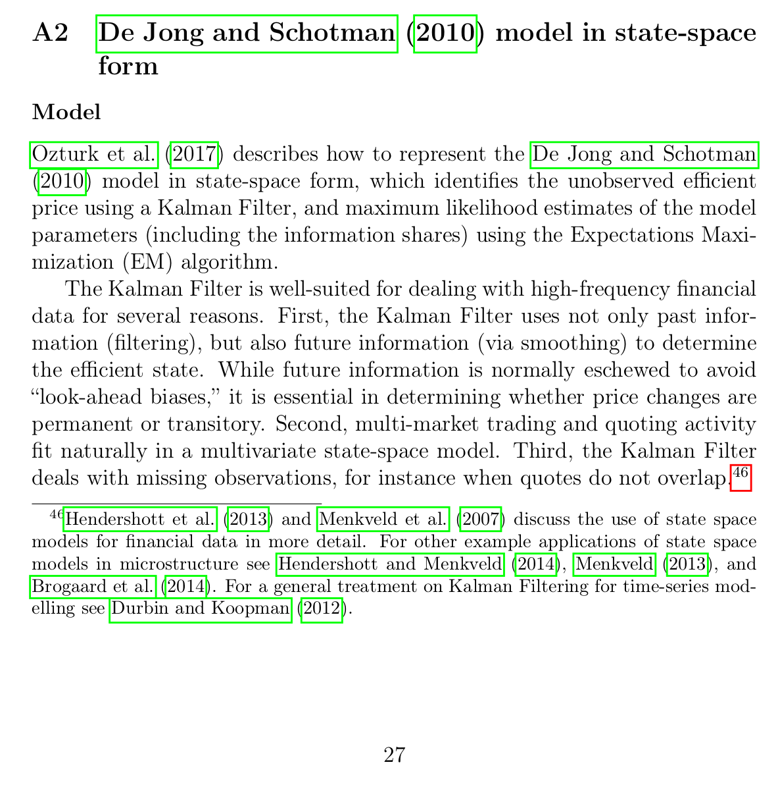
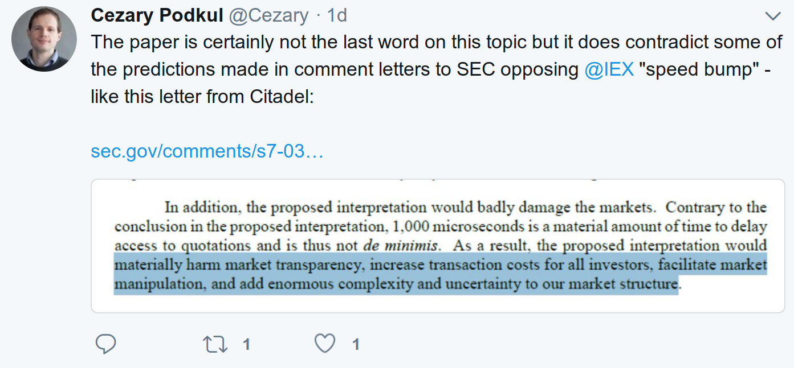

### IPCC wrong on climate change & SEC wrong on IEX

>*“Do the best you can until you know better. Then when you know better, do better.”*
>*[Maya Angelou](http://www.notablebiographies.com/An-Ba/Angelou-Maya.html)*

I've long been troubled by the IPCC report on climate change. It seems, to me a fairly clear dereliction of duty to arrive at the conclusions it did. Mainly I find it is due to a lack of science in the report. Time is proving my thoughts quite correct[^ipcc_debunk] , [^ipcc_nature].

The IPCC underestimated climate change quite badly. Models were included that were obviously worse than others. Those bad models largely pulled the conclusions in the same direction - ***down***; especially in terms of the confidence interval. We are now finding all sorts of unknown aspects, ice shelf collapse, sea base methane release, etcetera are much worse than anticipated. The IPCC modelling has been shown to be flawed. Climate change is much worse than what we have been told.

Part of the problem is political interference with the science. No doubt the IPCC felt pressure to be as conservative as possible. They included a broad range of models that should have been excluded. Politricks won. Truth lost.

Pseudoscience is a complex and dangerous beast. I hope this IPCC example illustrates the point. I am also pretty confident the IPCC didn't intentionally wish bad science upon itself.

### SEC wrong on IEX

The WSJ is reporting a disturbing headline today, 
> *["Study Finds ‘Speed Bumps’ Help Protect Ordinary Investors"](https://www.wsj.com/articles/study-finds-speed-bumps-help-protect-ordinary-investors-1528974002)* by Cezary Podkul.

Hey, what?

That's absurd. There is simply no basis in reality for such a claim. A speed bump in such a style harms market transparency, increases transaction costs, adds complexity, and piles uncertainty on to an already contentious market structure[^IEX_101].

> “The evidence seems to be consistent with IEX’s speed bump resulting in improved market quality for some stocks,” Mr. Hu said in an interview. 

Dr Hu to you, even if he has no Tardis. Show the foolish kid with a PhD some respect.

The first line in the WSJ's article by Mr Podkul is, 
>"*Stock markets should take a break. Literally."*

So, is it the WSJ at fault for such drivel, Mr Podkul, or has Dr Hu run out on a limb too far and been caught in a little hyperbolic malpractice?

Then a few hours later the WSJ changes the first line to, 

> *"A brief delay in stock trading can help protect ordinary investors from high-frequency traders, according to a study by an economist at the Securities and Exchange Commission."*

That's a little less jingoistic at least.

You may read Dr Hu's paper at SSRN, [*Intentional Access Delays, Market Quality, and Price Discovery: Evidence from IEX Becoming an Exchange*](https://papers.ssrn.com/sol3/papers.cfm?abstract_id=3195001&mod=article_inline)

Here is the abstract for you:

[
<em>click to enlarge</em>
]()

The startlingly dumb thing that jumps out at you is the preposterous claim that IEX improves price discovery. IEX harms price discovery. That's its very mission. IEX penalises participants with extortionate fees if they dare move the lit price. The contortions Dr Hu's paper has to go through to arrive at an improving price discovery conclusion are embarrassing.

[
<em>click to enlarge</em>
]()

The nature of IEX is that it favours dark liquidity, recently over 75% of its total handled shares, according to IEX's own statistics is dark. Let's remind ourselves of this simple fact:

[
<em>click to enlarge</em>
]()

The debate around IEX outweighs its impact due to the perversions IEX's model has introduced to the market. IEX represents the thin end of the wedge in that it pulls the NMS into a state where less public price discovery is promoted, transactions cost more due to IEX's very high fees, and the financial community: funds, brokers, and traders, are hit with greater complexity and risk. 

Despite the harm IEX has done and continues to do to the market, IEX's impact is pretty irrelevant due to its small market share:

[
<em>click to enlarge</em>
]()

Small mercies are small mercies.

Mr David Weisberger points out some aspects of IEX's lousy price discovery business on  from 17th October 2017 within his blog, [*"IEX ignores DATA (again) to market their exchange"*](https://exquamblog.wordpress.com/2017/10/06/the-not-so-amazing-iex-flea-circus-continues/),
>Notice that IEX is dead last in executed percentage, with a fill rate of 1.8%, more than 75% below NYSE and 65% lower than NASDAQ.  Readers should note that this is the best data available[1] as it counts only shares accepted by the markets which are priced at the NBBO when the order was received.

Mr Weisberger gives one view on how bad IEX's execution quality is:
> [
<em>click to enlarge</em>
]()

He then concludes:
>This data, empirically proves that IEX does not provide better fill probability.  It proves the opposite, that investors who believe IEX’s false narrative are being misled and are likely suffering with higher execution costs as a result.  (When orders are unfilled, it creates opportunity costs.  That, of course, is the harm of allowing their misleading marketing to continue unabated) This data is surprising to people that believe Mr. Ryan’s assertion that it should be better to be alone at the NBBO at IEX, instead of being toward the end of the queue at another exchange.  I find that amusing, since the IEX narrative assumes that traders look at each individual exchange separately, like checkout lines in a supermarket.  That might have been true at the NYSE pre-Reg NMS, but today’s market participants use routing technology that evaluates the composite queue across exchanges.   Therefore, providing a higher certainty of execution tends to drive routing decisions, meaning that IEX, with their infrequent NBBO participation and high average spread, is not the fast line at the supermarket as they claim.
>
>Of course, neither the SEC, nor even the mainstream media seem to care about IEX’s continued use of factually wrong and misleading narratives.  To my perception, IEX management continues to behave more like carnival barkers than responsible regulators.  At some point, for the sake of all the investors that believe every word they say, my hope is that either they will change or the SEC will force them to. 

Let's get back to Dr Hu's paper.

The paper highlights much of what is wrong with the academic approach to the financial industry. You take a bias and false premise and try to fit a certain outcome. It helps a lot if you use mathematics and twist the work of others. This is precisely what Dr Hu does in his paper with or without a sonic screwdriver. He is young and just out of university, so I guess he will learn in time. Now is the time to learn from this paper.

IEX is dark and expensive and tends to execute at the midpoint. Dr Hu arrives at the conclusion that if you benchmark the midpoint oriented IEX against the midpoint it does OK. No shit Sherlock. That's the point of a dark pool that is parasitic to price discovery. There is no shame in that, but a public price discovery exchange engine it should not be. After all, what is the point of a public exchange without meeting that fundamental public need? 

There are many asset managers this kind of exchange that isn't an exchange does not suit. Some asset managers would prefer to accrete the spread by being passive. They hope not to regret too many things if the market runs away from them. IEX is a particularly bad place to trade if that is your schtick. 

An aspect of Dr Hu's paper I find particularly troubling is the hiding he does behind fancy greek symbols and mathematics hoping to reassure the reader there is a ***scientific*** point to his work. The good doctor is suffering from the same malaise as the IPCC faced: bad analysis. It is a bit different to the IPCC as the modelling and statistical approach was pretty flawed at the old IPCC, but here it is more about Dr Hu's assumptions and improper market dynamics interpretations. No shame in being wrong. It needs to be called out though. Hopefully, as a relatively recently minted postgraduate, he will learn to consider the broader picture and not shape his approach to any particular agenda in the future.

I mentioned in a tweet that if you apply the **lipstick** of a Kalman filter along with its state space modelling to a pig, you still have a pig. This is what I'm talking about here:
___
[
<em>click to enlarge</em>
]()
[
<em>click to enlarge</em>
]()
___
The key point here is the estimation part. Dr Hu is just modelling midpoints. You'll see the same midpoint bias in the ***Informational Efficiency Measures*** Dr Hu uses. 

Should we gloss over the free rider problem? Let's not, page 3: 

>The overall improvement in price discovery is harder to reconcile. In his Comment Letter, Eric Budish argues that a weakness of IEX’s market structure is that it only prevents latency arbitrage for (non-displayed) pegged orders, and does not help displayed limit orders which contribute to price discovery. As such, IEX’s market design can only succeed so long as it is able to “free-ride” off of other exchanges’ price discovery. Indeed, when I decompose exchanges’ contributions to price discovery using a state-space model, I find that IEX’s information share does not increase as it transitions from an ATS to an exchange. Hence, the improvements in price discovery are not directly attributable to IEX. Instead, it may be that the speed bump affects other forms of mechanical or regulatory arbitrage beyond “quote sniping,” which impacts price discovery.

One could conclude that that price discovery has improved in the market as a whole despite IEX. Perhaps it may have improved even more if IEX didn't exist. This is where Dr Hu perhaps needs a little more market experience. A PhD and a short stint with the SEC does not prepare you to understand this kind of thing I guess.

So, the paper is a bit screwy. We could arrive at the view that Dr Hu is a young guy. Give him a break. He'll do better next time. I think that is reasonable, but it is the consequences that are unreasonable. 

### Wall Street Journal

That the WSJ suddenly reported hysterical headlines from flawed reports is disturbing to me,

> #### **Study Finds ‘Speed Bumps’ Help Protect Ordinary Investors**
> **SEC economist’s conclusions bolster models like upstart exchange IEX, which aims to slow ultrafast traders**

A paper is made up of it journalists and editors. It was eventually pretty obvious to me that the article's author, Mr Cezary Podkul, is an unabashed IEX fanboy. It is also interesting that some of the tones of the original article have changed. A slight concession but not enough as the appalling headline remains. A few lines of at the top of the article varied:

Removed:
>**\-** Stock markets should take a break. Literally.

Changed:
>**\-** That is the message in a paper published on Wednesday by an economist at the Securities and Exchange Commission who concluded that a brief delay in stock trading would protect ordinary investors from high-frequency traders.

>**\+** A brief delay in stock trading can help protect ordinary investors from high-frequency traders, according to a study by an economist at the Securities and Exchange Commission.

Changed:
>**\-** The finding broadly endorses the business model of IEX Group Inc., an upstart exchange that slows down trading with a so-called speed bump that pauses inbound orders for 350 microseconds before relaying them to its exchange for execution. IEX also delays outbound updates to its market data feed.

>**\+** The study, published Wednesday, bolsters the case for the business model of IEX Group Inc., an upstart exchange that slows down trading with a “speed bump” that pauses inbound orders for 350 microseconds before relaying them to its exchange for execution. IEX also delays outbound updates to its market data feed.

Changed:
>**\-** When it sought SEC approval to become an exchange in 2015, IEX said the delay would prevent rapid-fire traders from racing ahead of typical investors and unfairly profiting off the speed advantage. That claim was disputed by high-tech market maker Citadel, which warned the SEC that allowing speed bumps would “increase transaction costs for all investors.”

>**\+** When it sought SEC approval to become an exchange in 2015, IEX said the delay would prevent rapid-fire traders from racing ahead of typical investors and unfairly profiting off the speed advantage. That claim was disputed by high-tech market maker Citadel LLC, which warned the SEC that allowing speed bumps would “increase transaction costs for all investors.” The study found a decrease in trading costs for some stocks.

The changes improved the quality of the article. The article remains an over the top representation from a fundamentally ***"challenged"*** report.

Mr Cezary Podkul[^LinkedIn] is quite an impressive young journalist winning [awards here and there](http://www.cezarypodkul.com/awards/) for various pieces. Some very good work in there, especially on his contributions to "The Rent Racket" and "Tobacco Bonds" stories.

He left his bias in plain sight though with this tweet:

[
<em>click to enlarge</em>
]()

You know the old saying: if you're young and not a socialist then you have no heart, and if you're old and not a conservative then you have no brain. It springs to mind that Mr Podkul's heart is misplaced from time to time.

It's kind of funny to consider the Citadel warning Mr Podkul refers to in the tweet that has come to pass:

- harm market transparency: 75-80% dark is harmful you'd have to say
- increase transaction costs for investors: have you seen IEX's expensive fees?
- add enormous complexity: it's a mess, thank you IEX
- add uncertainty: you can't even reconcile your fees, remember the mea culpa when IEX had to send out refunds, their crumbling quote indicator is often wrong, you don't know what you are going to be charged as it is subject to IEX's interpretation (often wrong) of market conditions

Good highlight Mr Podkul. It turns out Citadel was right on the money. Are you really that blind?

I had the temerity to point out how I felt about this flawed article and report in a couple of tweets. Mr Chris Nagy showed how mature the debate around the IEX issue is:

It's a bit of a childish tweet from Mr Nagy[^Nagy], but as CEO for Healthy Markets he is normally more astute and reasoned so we'll give him a pass.

### SEC problems

I think this naive paper by Dr Hu highlights a few problems at the SEC since [Mrs Mary Jo White](https://en.wikipedia.org/wiki/Mary_Jo_White) ran the show. The whole ICO and virtually currency debacles are getting quite stupid when SEC spokespeople think it is reasonable to call Ethereum ***not*** a security. I don't think history will be kind to such an incorrect, incoherent, and indefensible point of view.

The SEC seemed a good home for the CFTC, especially given the overlapping fines and jurisdictions, e.g. FX, and challenges the CFTC often face. Perhaps the CFTC should be taking over the SEC as the SEC seems to be acting the junior partner in these days of daze.

Look at the kind of ridiculous debate around the SEC's fee pilot. I've been steering clear of that issue as it is one of those heated debates where one side is so obviously wrong it should be damned obvious. Alas, it is not judging by the number of comment letters. 

The set up of the pilot is just all wrong. How can you have such an impactful study without a reasonable and testable null hypothesis and hypothesis? The most likely outcome of the study is that you will have arguments over the data and the impact on other aspects of the market, such as with all the ATS's. Is there a way to measure the impact of passive liquidity not being traded with? No. Is there full transparency on routing and beneficiaries? No. 

Market fees are a real problem as the direct fees have been subject to unconscionable rates of increase over the years. Marketplaces can get away with such piracy as the demand is inelastic. You gotta have the data. 

Transaction fees are different. You have a lot of choices. There is also a reasonable argument to be had for higher fees for increased price provision at best and for stoking competition with the PFOF community who can effectively quote at sub-penny[^sub_penny] increments providing prices public exchanges simply can't compete with. The size of a particular fee is perhaps an ill-considered priority just as the fee pilot is an ill-conceived pilot.

You have to ask yourself, how did this fee pilot get so advanced. It looks like the SEC can be bullied by the funds and banks who want lower fees. Everyone should be aware of the politricks involved. 

The SEC should be smarter. The SEC needs to be smarter. 

The SEC certainly should not have published with their tentative imprimatur rubbish papers like Dr Hu's. If you do, you'll get hypocritical headlines like, "SEC wrong on IEX" (see above.) You see, I can publish scandalously like the WSJ too :P.

Happy trading,

--Matt.

______

### Older IEX meanderings
<ul style="background-color: white; font-family: &quot;Trebuchet MS&quot;, Trebuchet, sans-serif; font-size: 13px; line-height: 1.4; margin: 0.5em 0px; padding: 0px 2.5em;">
<li style="margin: 0px 0px 0.25em; padding: 0px;"><a href="https://meanderful.blogspot.com/2018/01/iex-marketing-contortions.html" target="_blank">IEX marketing contortions</a></li>
<li style="margin: 0px 0px 0.25em; padding: 0px;"><a href="https://meanderful.blogspot.com.au/2017/12/is-iex-giffen-good.html" target="_blank">Is IEX a Giffen Good?</a></li>
<li style="margin: 0px 0px 0.25em; padding: 0px;"><a href="https://meanderful.blogspot.com.au/2017/06/rebate-trafficking.html" style="color: #954000;" target="_blank">Rebate trafficking</a></li>
<li style="margin: 0px 0px 0.25em; padding: 0px;"><a href="https://meanderful.blogspot.com.au/2015/08/trading-rebates-choice-not-evil.html" style="color: #2d84bd;" target="_blank">Trading rebates - a choice, not an evil</a></li>
</ul>
<ul style="background-color: white; font-family: &quot;Trebuchet MS&quot;, Trebuchet, sans-serif; font-size: 13px; line-height: 1.4; margin: 0.5em 0px; padding: 0px 2.5em;">
<li style="margin: 0px 0px 0.25em; padding: 0px;"><a href="https://meanderful.blogspot.com.au/2016/06/iex-good-bad-and-ugly.html" style="color: #2d84bd;">IEX - the good, the bad, and the ugly</a>&nbsp;[June 2016]</li>
<li style="margin: 0px 0px 0.25em; padding: 0px;"><a href="https://meanderful.blogspot.com.au/2016/07/iex-discretionary-peg-dpeg-calculation.html" style="color: #954000;">IEX Discretionary Peg (DPEG) calculation and patent</a>&nbsp;[July 2016]</li>
<li style="margin: 0px 0px 0.25em; padding: 0px;"><a href="https://meanderful.blogspot.com.au/2016/10/iex-dark-and-expensive.html" style="color: #2d84bd;">IEX: dark and expensive</a>&nbsp;[October 2016]</li>
<li style="margin: 0px 0px 0.25em; padding: 0px;"><a href="https://meanderful.blogspot.com.au/2016/12/iex-innovation-killing-innovation.html" style="color: #2d84bd;">IEX innovation killing innovation</a>&nbsp;[December 2016]</li>
<li style="margin: 0px 0px 0.25em; padding: 0px;"><a href="https://meanderful.blogspot.com.au/2017/03/iex-patents.html" style="color: #2d84bd;">IEX patents</a>&nbsp;[March 2017]</li>
<li style="margin: 0px 0px 0.25em; padding: 0px;"><a href="https://meanderful.blogspot.com.au/2017/04/iex-trading.html" style="color: #2d84bd;">IEX trading</a>&nbsp;[April 2017]</li>
<li style="margin: 0px 0px 0.25em; padding: 0px;"><a href="http://iex%20signal%20or%20iex%202.0/" style="color: #2d84bd;">IEX Signal or IEX 2.0</a>&nbsp;[April 2017]</li>
<li style="margin: 0px 0px 0.25em; padding: 0px;"><a href="https://meanderful.blogspot.com.au/2017/05/nyse-american-attack-of-clones.html" style="color: #2d84bd;">NYSE American - attack of the clones</a>&nbsp;[May 2017]</li>
<li style="margin: 0px 0px 0.25em; padding: 0px;"><a href="https://meanderful.blogspot.com.au/2017/05/speed-bump-101.html" style="color: #2d84bd;">Speed-bump 101</a>&nbsp;[May 2017]</li>
<li style="margin: 0px 0px 0.25em; padding: 0px;"><a href="https://meanderful.blogspot.com.au/2017/06/iex-statistics-for-may-devil-is-in.html" style="color: #2d84bd;" target="_blank">IEX statistics for May: the devil is in the details</a>&nbsp;[June 2017]</li>
<li style="margin: 0px 0px 0.25em; padding: 0px;"><a href="https://meanderful.blogspot.com.au/2017/06/iexs-new-orders-unintended-consequences.html" style="color: #2d84bd;" target="_blank">IEX MM-Peg follow up</a>&nbsp;[June 2017]</li>
</ul>
 

___

##### Footnotes

[^ipcc_debunk]: [Conservative nature of IPCC reports](https://en.wikipedia.org/wiki/Intergovernmental_Panel_on_Climate_Change#Conservative_nature_of_IPCC_reports) 

[^ipcc_nature]: "[*Greater future global warming inferred from Earth’s recent energy budget*](https://www.nature.com/articles/nature24672)", Patrick T. Brown & Ken Caldeira, Nature volume 552, pages 45–50 (07 December 2017  [ 
<em>click to enlarge</em>
]()

[^LinkedIn]: [Cezary Podkul](https://www.linkedin.com/in/cezarypodkul), Senior Reporter at The Wall Street Journal, Previous: ProPublica, Reuters, The Washington Post, Education: Columbia University - Graduate School of Journalism 

[^sub_penny]: [Meanderful: Sub-pennies rule! ](https://meanderful.blogspot.com/2017/04/sub-pennies-rule.html)

[^IEX_101]: [Meanderful: Speed-bump 101 ](https://meanderful.blogspot.com/2017/05/speed-bump-101.html)

[^Nagy]: [Chris Nagy, Co-founder & Director Healthy Markets ](https://www.linkedin.com/in/1christophernagy/)